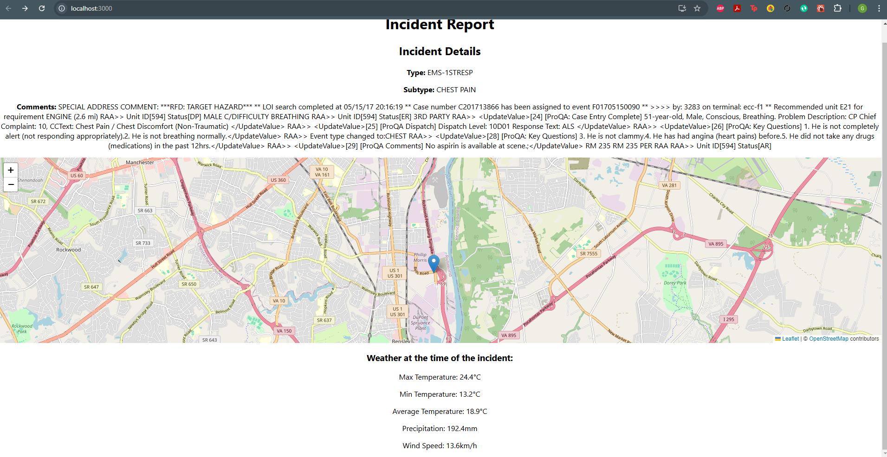

# fire-department-incidents-assessment

This project enriches 911 emergency incident data with weather information using the Meteostat API and displays the incident location on a map using React and Leaflet.

---

## Features

- **Incident Details**: Displays incident type, subtype, and comments.
- **Map Integration**: Shows the incident location on an interactive map using Leaflet. Inlcudes a marker with more details regarding the incident.
- **Weather Data**: Fetches and displays weather conditions at the time of the incident using the Meteostat API.

---

## Prerequisites

I do not have access to an OSX machine. 
The steps provided will be for a Windows machine, and how to install and run the project on a window machine.
Before running the project, ensure you have the following installed and configured if necessary:

- Visual Studio Code or any other IDE you prefer. For this project and my recommendation, I used Visual Studio (VS) Code. For the rest of the instructions, I will assume you are using VS Code.
- Git or GitBash
- [Node.js](https://nodejs.org/) (v16 or higher)
- [npm](https://www.npmjs.com/) (comes with Node.js)
- A Meteostat API key (sign up at [Meteostat](https://dev.meteostat.net/))

---

## Installation 

1. Open VS Code, and clone this repository to your local machine.
2. After cloning, open a terminal or command prompt in VS code and navigate to where you cloned this repository.
3. Type "npm i" in the cmd terminal. This will install the necessary packages needed to run the application.
4. After successful installation of the packages, type "npm start". A browser window should open with the application running.

Once the application is running, it should display a page with a leaflet map and a marker icon on the map. 
The page will display the incident and some details (type, subtype, and comments) above of the map. Below the map will be the weather details (enrichment) during the date of the incident.
Clicking on the marker icon the map will show more details and enrichment about the incident (address, coordinates, incident number, etc.)
You can use you scroll wheel to zoom in/out of the map, or use the +/- sign on the top left of the map as well.
Check out the Screenshots section below to see what the project looks like if it is running correctly.

## Troubleshooting

- If weather data below the leaflet map is not being displayed, the API key may have expired or reached the request limit allowed for that key. Currently, the Meteostat Rapid API free version allows for 500 API requests before expiring. You would need to acquire a new API key, and use that to replace the current API key in WeatherComponent.js in the headers on line 23. In production, normally you could replace this key and keep it updated in a .env file.
- If you are having trouble running the application, make sure you have the necessary dependencies installed. These dependencies can be found in the package.json file
- NOTE: This application uses a hardcoded incident data file that is written in the App.js file on line 2. This is done as per the instructions of this take-home, as it would siffice for the purpose of the assessment. There is also another incident file in the data folder. You can change the file number in App.js on line 2 and save it. When you reload the page, you should seethis new data set and its details in the application. 

---

## Project Structure

fire-department-incidents-assessment/
├── public/
├── src/
│   ├── components/
│   │   ├── MapComponent.js
│   │   ├── WeatherComponent.js
│   │   └── IncidentDetail.js
│   ├── data/
│   │   └── F01705150050.json
|   |   └── F01705150090.json
|   ├── .env
│   ├── App.js
│   ├── index.js
│   └── styles.css
├── package.json
└── README.md

---

## Components 

1. **MapComponent.js**:
Displays the incident location on an interactive map using Leaflet.
Includes a marker with a popup showing incident details.

2. **WeatherComponent.js**:
Fetches weather data for the incident location and date using the Meteostat API.
Displays temperature(max, min, & average), precipitation, and wind speed on that date and location.

3. **IncidentDetail.js**:
Combines the MapComponent and WeatherComponent to display all incident details.

---

## Screenshots

Here are some of the screenshots.

---

## How much time did you spend on the project?

About 2.5-3 hours. This includes implementation, some research, creating the README, and commenting.

---

## What improvements would you make or best practices would you utilize if you had double the time?

- Improve the UI. This is a basic implementation, and we are just displaying the data on the screen. I would try to make it more appealing and easy to read
- Try and implement this in TypeScript. Although I do not have much experience with it, I would try and improve the code with TypeScript. 
- Possibly implement some more test cases. Given there are two test files, that should suffice to see if the project is working for now.
- Implement Lazy or suspense. In production, I would assume we are pulling much more data in, which would cause some perfomrance issues. Lazy or suspense could fix some of that.
- Given more time and if more features are going to be built, it most likely will need better state management, like Redux.
- Error handling with error boundaries. Implemented some this when fetching the data from the API but there could be other places for error handling as well.
- Add some security as well, to protect sensitive 911 data and other data extracted from it. Log-in page, accounts, user access, API security (rate-limit requests), etc.
- Already using this, and continue to use functional components when building out more of the application.

## Conclusion

This project demonstrates how to leverage React, Axios, and Leaflet to build web application that enriches data given from a file, and visualizes data fetched from an external API like Meteostat. By utilizing React’s component-based architecture, Axios for seamless API calls, and Leaflet to display dynamic maps, we have created the beginnings of a rich and engaging user experience with this application. Overall, a solid project that could be built out with many more features and could potentially be used in the real world.
